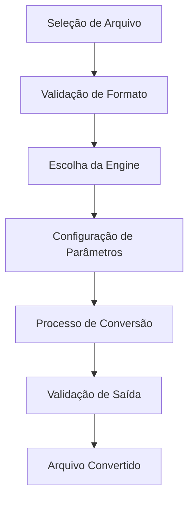

# MultiConvert Pro - Documentação Técnica

##  Arquitetura do Sistema

O MultiConvert Pro foi desenvolvido seguindo os princípios de arquitetura modular e orientada a objetos, garantindo escalabilidade, manutenibilidade e extensibilidade.

### Padrões de Design Utilizados

- **Strategy Pattern**: Para diferentes engines de conversão
- **Factory Pattern**: Para criação de conversores específicos
- **Observer Pattern**: Para notificações de progresso
- **Command Pattern**: Para operações de conversão
- **Singleton Pattern**: Para configurações globais

### Estrutura de Camadas

```

           UI Layer (PySide6)        

         Business Logic Layer        

         Conversion Engines          

         File System Layer           

```

##  Engines de Conversão

### FFmpeg Engine
- **Responsabilidade**: Conversão de mídia (vídeo/áudio)
- **Formatos Suportados**: MP4, AVI, MOV, MP3, WAV, FLAC
- **Recursos**: Compressão, redimensionamento, extração de áudio

### Pillow Engine
- **Responsabilidade**: Processamento de imagens
- **Formatos Suportados**: JPG, PNG, BMP, GIF, TIFF, WebP
- **Recursos**: Redimensionamento, rotação, filtros, otimização

### LibreOffice Engine
- **Responsabilidade**: Conversão de documentos
- **Formatos Suportados**: PDF, DOCX, ODT, XLSX, PPTX
- **Recursos**: Preservação de formatação, conversão em lote

### OnlyOffice Engine
- **Responsabilidade**: Engine alternativa para documentos
- **Formatos Suportados**: Documentos Office modernos
- **Recursos**: API REST, conversão em nuvem

##  Fluxo de Conversão



##  Sistema de Validação

### Validação de Entrada
- Verificação de formato de arquivo
- Validação de integridade
- Verificação de tamanho máximo
- Detecção de arquivos corrompidos

### Validação de Saída
- Verificação de sucesso na conversão
- Validação de formato de destino
- Verificação de qualidade
- Comparação de metadados

##  Otimizações de Performance

### Processamento Paralelo
- Conversão em lote com threads
- Pool de workers para múltiplas conversões
- Balanceamento de carga automático

### Cache Inteligente
- Cache de configurações frequentes
- Reutilização de engines inicializadas
- Cache de metadados de arquivos

### Gerenciamento de Memória
- Liberação automática de recursos
- Monitoramento de uso de RAM
- Otimização para arquivos grandes

##  Sistema de Plugins

### Estrutura de Plugin
```python
class ConverterPlugin:
    def __init__(self):
        self.name = "Plugin Name"
        self.version = "1.0.0"
        self.supported_formats = []
    
    def convert(self, input_file, output_file, options):
        # Implementação da conversão
        pass
    
    def validate(self, file_path):
        # Validação do arquivo
        pass
```

### Plugins Disponíveis
- **ImageMagick Plugin**: Processamento avançado de imagens
- **Pandoc Plugin**: Conversão de documentos markdown
- **GIMP Plugin**: Edição automatizada de imagens
- **Blender Plugin**: Conversão de modelos 3D

##  Internacionalização

### Idiomas Suportados
- Português (Brasil) - pt_BR
- Inglês (Estados Unidos) - en_US
- Espanhol - es_ES
- Francês - fr_FR
- Alemão - de_DE

### Sistema de Tradução
- Arquivos .po para traduções
- Carregamento dinâmico de idiomas
- Fallback automático para inglês

##  Monitoramento e Logs

### Sistema de Logs
```python
import logging

# Configuração de logs
logging.basicConfig(
    level=logging.INFO,
    format="%(asctime)s - %(name)s - %(levelname)s - %(message)s",
    handlers=[
        logging.FileHandler("multiconvert.log"),
        logging.StreamHandler()
    ]
)
```

### Métricas Coletadas
- Tempo de conversão por formato
- Taxa de sucesso/falha
- Uso de recursos do sistema
- Formatos mais utilizados

##  Segurança

### Validação de Arquivos
- Verificação de assinatura de arquivo
- Detecção de malware básica
- Limitação de tamanho de arquivo
- Sanitização de nomes de arquivo

### Isolamento de Processos
- Execução de conversões em processos separados
- Timeout para operações longas
- Limpeza automática de arquivos temporários

##  Testes

### Estrutura de Testes
```
tests/
 unit/                   # Testes unitários
    test_converters.py
    test_engines.py
    test_validators.py
 integration/            # Testes de integração
    test_conversion_flow.py
    test_ui_integration.py
 performance/            # Testes de performance
     test_batch_conversion.py
     test_memory_usage.py
```

### Cobertura de Testes
- Cobertura mínima: 80%
- Testes automatizados no CI/CD
- Testes de regressão
- Testes de performance

##  Build e Deploy

### Processo de Build
```bash
# Instalação de dependências
pip install -r requirements.txt

# Execução de testes
pytest tests/

# Build do executável
pyinstaller --onefile --windowed main.py

# Criação do instalador
nsis installer/setup.nsi
```

### Distribuição
- Executável standalone para Windows
- AppImage para Linux
- DMG para macOS
- Distribuição via PyPI

##  Versionamento

### Semantic Versioning
- **MAJOR**: Mudanças incompatíveis na API
- **MINOR**: Novas funcionalidades compatíveis
- **PATCH**: Correções de bugs

### Changelog
- Documentação de todas as mudanças
- Categorização por tipo (Added, Changed, Fixed, Removed)
- Links para issues e pull requests

##  Roadmap Técnico

### Versão 2.0
- [ ] API REST para conversões remotas
- [ ] Interface web responsiva
- [ ] Suporte a conversão em nuvem
- [ ] Sistema de filas distribuído

### Versão 2.1
- [ ] Machine Learning para otimização automática
- [ ] Conversão baseada em IA
- [ ] Reconhecimento automático de conteúdo
- [ ] Sugestões inteligentes de formato

### Versão 3.0
- [ ] Arquitetura de microserviços
- [ ] Containerização com Docker
- [ ] Orquestração com Kubernetes
- [ ] Escalabilidade horizontal

##  Recursos Adicionais

### Documentação
- [API Reference](docs/api/)
- [Plugin Development Guide](docs/plugins/)
- [Troubleshooting Guide](docs/troubleshooting/)
- [Performance Tuning](docs/performance/)

### Comunidade
- [Discord Server](https://discord.gg/multiconvertpro)
- [Stack Overflow Tag](https://stackoverflow.com/questions/tagged/multiconvertpro)
- [Reddit Community](https://reddit.com/r/multiconvertpro)

---

**Desenvolvido com  por ailtondba**
